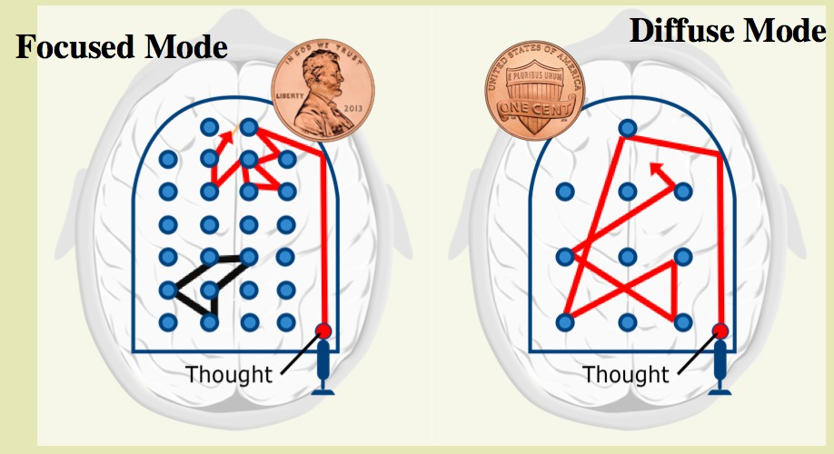
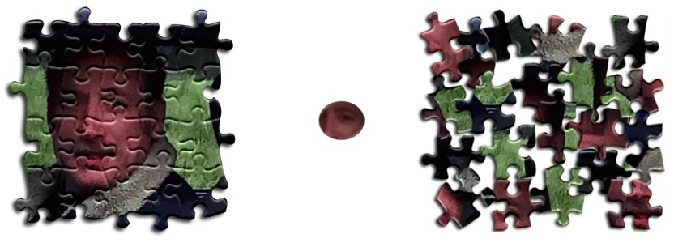
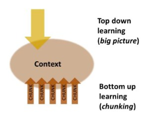
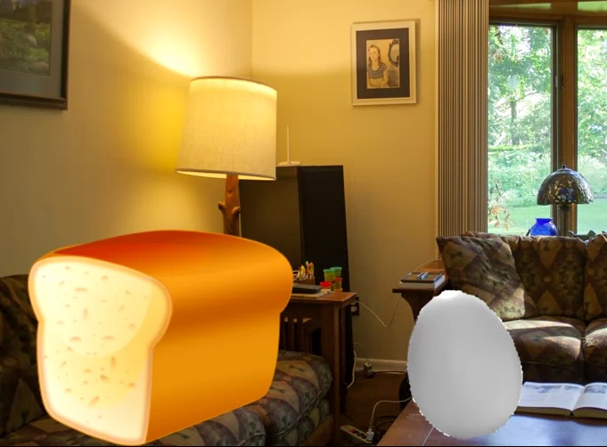
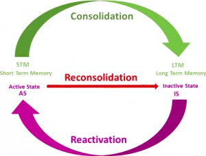
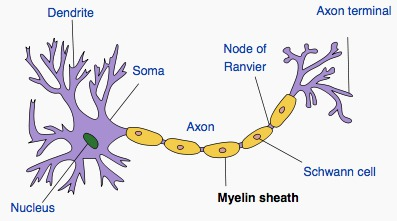

# Learning how to learn

*Принял   решение,  дабы   запоминаемый  материал   лучше  усваивался,   писать
небольшие  конспекты  по нему.  Первый  на  очереди  -  курс [Learning  how  to
learn](https://www.coursera.org/course/learning). При написании применяю подход
"интервальное повторение", описанный  ниже - при просмотре  материала за неделю
просто запоминаю, на следующий день прохожу тест, на следующий после теста пишу
конспект, а ещё через день - финальная вычитка и редактирование.*

## Сфокусированное и рассеянное мышления

Существует  два   типа  мышления:   **сфокусированное**,  когда   поток  мыслей
упорядочен  и  управляем и  мысли  не  выходят  за  пределы связанных  с  темой
размышления  понятий,  и  **рассеянное**,  когда поток  мыслей  хаотичен  и  не
управляем и не ограничивается одной темой.

Сфокусированное  мышление должно  использоваться при  выполнении уже  известной
задачи, исполнения по алгоритму; рассеянное же мышление - для "генерации" идей,
для  решения доселе  неизвестных  задач.  Сфокусированное мышление  достигается
концентрацией  внимания на  интересующей  теме; рассеянное  - погружением  себя
в  расслабленное,   "рассеянное"  состояние,  когда  никакого   обдумывания  не
происходит: путём приёма душа, физических  упражнений, дрёмы, прогулок или даже
просмотра не заставляющих напрягаться мозг видео.

**Использование  аналогий** -  хороший  способ запомнить  и понять  абстрактные
понятия. Важно при этом найти хорошую аналогию, чтобы не вводила в заблуждение.
Например,  на  картинке  ниже  два типа  мышления  сравниваются  с  пинбольными
автоматами.

**Прокрастинация** - попытка мозга отсрочить исполнение задачи, ассоциируемое с
дискомфортом, и  незаметное смещение  внимания на другие,  возможно, связанные,
но  менее  полезные  для  достижения  задачи  виды  деятельности.  Исследования
показывают, что данное состояние исчезает,  стоит лишь поработать над задачей в
течение  некоторого времени.  Хорошим  средством для  борьбы с  прокрастинацией
является  **техника  "Помидор"**  -   серия  из  четырёх  25-минутных  отрезков
сосредоточенной  работы  над   задачей,  перемежаемых  пятиминутными  отрезками
отдыха,  во  время  которых  *необходимо* поощрить  себя,  занимаясь  тем,  чем
хочется.

Ничего  не   поможет  запомнить   любые,  даже  очень   абстрактные  (например,
математические) знания лучше, чем **практика**,  даже если простых аналогий для
них придумать  нелегко. Знания  - абстрактные, но  нейронные связи  - реальные.
Можно научиться всему, чему угодно, просто уделяя достаточно времени практике.

Рабочая  память   человека  имеет   весьма  малый  объём   (всего  4   слота  в
префронтальной  коре  головного мозга)  по  сравнению  с долговременной.  Чтобы
знания действительно запомнились,  необходимо из рабочей памяти  перевести их в
долговременную, уделив достаточно времени  практике. Можно использовать подход,
называемый **"интервальное повторение"** (spaced repetition), когда необходимую
информацию (например,  новое слово  на иностранном  языке) повторяют  в течение
недели с парой перерывов длиной в один день.

**Сон** -  очень важный элемент  при обучении. Сон позволяет  организму вывести
токсины  из  мозга,  избавиться  от ненужной  информации  и  закрепить  нужную.
Повторение необходимой для запоминания информации перед сном или желание, чтобы
решение  проблемы приснилось  во сне,  действительно  могут помочь.  Сон -  это
"нативное" "рассеянное мышление".

Помещение себя в  богатое в плане знаний и новых  вызовов окружение, постоянное
изучение  чего-то   нового  в  длительной  перспективе   отодвигает  старческие
расстройства мозга и увеличивает продолжительность жизни.

## Чанкинг

**Чанк**  (кусочек)  -  некая  часть информации  о  рассматриваемом  материале,
которая  не существует  сама по  себе, но  имеет связи  с другими  чанками, всё
вместе  это образует  контекст.  Чанкинг помогает  лучше запоминать  информацию
за  счёт целенаправленного  создания  связей о  рассматриваемой  теме, за  счёт
уменьшения  объёма  требуемой  рабочей  памяти (которая,  как  можете  помнить,
содержит всего лишь около четырёх слотов).  Кусочек информации сам по себе, без
контекста, имеет мало  пользы. Поэтому важно целенаправленно  создавать чанки и
налаживать связи между ними.

Главным  способом  создания  чанков  является практика.  При  изучении  нового,
незнакомого материала,  сперва необходимо обращаться к  примерам вместо попыток
разобраться самостоятельно.  Например, при изучении  новой мелодии при  игре на
гитаре имеет смысл  сначала послушать её, возможно несколько раз,  чем сразу же
пытаться сыграть. При изучении решений примеров необходимо рассматривать каждое
более широко, отмечать  основные шаги, а не вдаваться в  детали. Важно обращать
внимание  на связь  между отдельными  шагами, нежели  на то,  как они  работают
по-отдельности.

Чтобы создать новый чанк, необходимо применить три шага.

Первый  -  **концентрация  внимания**. Необходимо  сфокусироваться  на  задаче,
приложив  все  усилия  к  тому,  чтобы  внимание  не  рассеивалась  на  внешние
раздражители:  выключить телевизор,  телефон,  повесить на  дверь табличку  "не
беспокоить" и т. п.

Второй  шаг -  **понимание  базовой идеи**  изучаемого материала.  Недостаточно
просто  посмотреть на  решение задачи  и запомнить,  как это  делается. Простое
запоминание может создать чанк, но он  будет бессмысленным, потому что не будет
иметь  связей с  другими чанками  в контексте.  Понимание -  это клей,  который
связывает  все чанки  воедино.  Лучший способ  проверить,  пришло ли  понимание
материала  - протестировать  себя,  решив пример  без  обращения к  подсказкам.
Простое наблюдение не даёт нам навыков: смотря, как художник рисует, не станешь
художником сам.

Третий шаг -  **создание контекста**, который будет подсказывать  не только как
использовать отдельные чанки, но и когда  их можно использовать. Контекст - то,
что  связывает  отдельные чанки  в  область  знаний  о предмете.  Для  создания
контекста необходимо много  практиковаться, а также решать  задачи за пределами
основного материала.

Процесс  обучение происходит  как **снизу-вверх**  (создание отдельных  навыков
решения  конкретных  задач путём  практики  -  чанков), так  и  **сверху-вниз**
(осознание  большой картины;  понимание, к  чему набор  чанков относится).  Оба
направления жизненно важны для мастерского овладения предметом изучения.

Ранее считалось, что для изучения нового материала достаточно перечитывать его,
пока не запомнится. Но опыты  выявили, что попытки вспомнить основные концепции
сразу  после прочтения  вместо перечитывания  более благотворно  сказываются на
запоминании и глубине получаемых знаний. Перечитывание имеет смысл, только если
прошло достаточно много времени.

При изучении материала многочисленные  подчёркивания, выделения цветом в тексте
способствуют появлению  у студентов т. н.  **иллюзии компетентности**: кажется,
что,  выделив какое-то  предложение цветом,  произошло его  запоминание, но  на
самом деле это не так. Поэтому  необходимо свести подобные практики к минимуму.
С другой стороны,  заметки на полях -  хорошая идея, потому что  они чаще всего
являются  изложением  собственных мыслей  об  изучаемом  предмете. Опыты  также
показывают, что самотестирование после изучения материала хорошо сказывается на
его запоминании. При  этом, если случаются ошибки, нет ничего  страшного, и это
даже хорошо -  они разрушают иллюзию компетентности и показывают,  на чем нужно
заострить внимание.

При подготовке к  экзамену имеет смысл тестировать себя в  разных окружениях, а
не только в своей комнате, чтобы  не создавать какой-то подсознательной связи с
определённым местом  и свести  стресс от  смены обстановки  (на экзаменационную
комнату) к минимуму.

Биохимия мозга также оказывает влияние на процесс запоминания материала, хотя и
не такое сильное, как сознательная  концентрация внимания. К примеру, материал,
который интересно изучать, будет запоминаться легче.

**Нейромидиаторы** -  химические элементы,  с помощью которых  нейроны общаются
между собой.  Мы рассмотрим  три из  них, которые  влияют на  процесс обучения.
**Ацетилхолин**  отвечает за  концентрацию внимания  и управляет  пластичностью
синапсов, что  прямым образом влияет  на создании новой  долговременной памяти.
**Допамин**  освобождается из  специальной небольшой  группы нейронов  в стволе
мозга  в  случае  появления  неожиданной (в  данный  момент)  награды.  Допамин
участвует в  предсказании будущих (а  не только сиюминутных) наград  и поощряет
текущие действия если они могут  привести к такой награде. **Сератонин** влияет
на социальные  аспекты жизни.  Опыты на  обезьянах показывают,  что альфа-самцы
имеют более высокий уровень сератонина; между  тем, низкий его уровень связан с
рискованным  поведением: преступники,  совершившие жестокие  преступления, чаще
всего имеют весьма низкий уровень сератонина.

Эмоции также влияют на процесс обучения. Долго считалось, что эмоции не связаны
с осознанным поведением, но недавние исследования показывают, что они оказывают
значительное влияние  на внимание, процессы обучения  и память. **Миндалевидное
тело**,  совместно  с  гиппокампусом,  участвует  одновременно  и  в  процессах
принятия решений и работе памяти,  и в регуляции эмоциональных реакций. Поэтому
для успешного обучения желательно иметь и хорошее настроение.

Наличие большой "библиотеки" чанков  способствует как приобретению новых знаний
(в  сфокусированном режиме),  так и  решению креативных  задач (в  рассеянном).
**Трансфер** (передача) -  ситуация, когда изученный чанк  оказывается связан с
совершенно другой областью знаний (например, при построения аналогий). Наиболее
глубокие  знание  даёт усиленное  обучение  и  практика решения  самых  сложных
примеров,  но  здесь  есть  подводные камни.  **Einstellung**  ("установка")  -
название ситуации, когда некая  "вызубренная" идея мешает креативному мышлению,
поиску нового решения. Порой необходимо "забыть" то, что усиленно изучал, чтобы
найти более удачное решение какой-то проблемы.

## Прокрастинация и память

Как уже  было отмечено,  прокрастинация -  способ мозга  избежать ассоциируемое
им  с   дискомфортом  действие   (буквально  -  задействуются   болевые  центры
мозга)  путём переключения  внимания на  что-то другое,  придумывания различных
отговорок и  оправданий, почему приступать  к выполнению дела не  стоит. Начать
прокрастинировать очень легко,  потому мозг сам этого хочет.  С другой стороны,
применение силы воли для удержания внимания - очень затратный процесс. На самом
деле нужды  применять силу воли  нет совсем,  т. к. прокрастинация  имеет много
общего с привычками, а это значит, что ею можно управлять, как можно выработать
полезную привычку или избавиться от вредной.

Привычка -  способ мозга  делать что-то  "на автомате",  в "режиме  зомби", без
необходимости концентрации  внимания, что  является способом  экономии энергии;
состоит из четырёх частей.

**Триггер** -  то, что заставляет  привычку срабатывать. Увидел первый  пункт в
todo-списке  - начал  выполнять весь  список. Увидел  электронное сообщение  от
друга  - прекратил  работу и  начал чатиться.  Триггеры сами  по себе  не имеют
большой силы - важно то, как мы реагируем на них.

**Реакция** (неосознанная) на  триггер, т. е. непосредственно  те действия, что
совершаются "на автомате", в "режиме зомби", с целью получить награду.

**Награда**   ожидает    в   конце    исполнения   привычки.    Именно   потому
прокрастинировать  легко, что  награда -  избавление от  чувства дискомфорта  -
предоставляется сразу же. Трюк в  том, что хорошие привычки можно стимулировать
наградой тоже - и это даёт возможность контролировать прокрастинацию.

**Вера**  в  то, что  привычку  нельзя  изменить (или  выработать).  Необходимо
избавиться от этой веры, чтобы начать влиять на привычку.

Одним из залогов успеха при  обучении чему-то является использование ментальных
трюков и подходов, помогающих мотивировать  и вдохновить себя. Иметь негативные
эмоции перед началом  неинтересной работы - нормально. Важно,  какая реакция на
это  последует. Обычно  "аппетит  приходит  во время  еды"  - после  некоторого
времени работы негативные эмоции исчезают,  поэтому можно себя вдохновлять этим
фактом. Другой трюк  - концентрация на процессе работы, а  не на её результате.
Концентрация на  результате приводит к постоянным  вопросом к себе "когда  же я
закончу?", в  то время как концентрация  на процессе - к  спокойному выполнению
этапов задачи один за другим.  Применение техники "Помидоро" также способствует
концентрации  на  процессе.  Важно минимизировать  число  отвлекающих  факторов
(телефон, почта, чаты), т. е. избавиться от лишних триггеров.

Необходимо  заставить свой  "режим зомби"  работать  на себя.  Ключевая идея  -
переопределить  реакцию на  триггер  в привычке.  Это  единственное место,  где
нужно  применить силу  воли.  Триггер обычно  относится  к четырём  категориям:
местоположение,  время, настроение  и реакция  (на других  людей или  события).
Можно избежать  исполнения привычки, просто избежав  соответствующих триггеров.
Награда является  важным пунктом, т. к.  закрепляет привычку - она  должны быть
честной и соответствующей сложности задачи.

Для  качественного управления  временем полезно  использовать **todo-списки**  -
еженедельные, со списком  ключевых задач на неделю, и  ежедневные, которые лучше
составлять перед сном, чтобы подключить  рассеянный режим мышления. Важно, чтобы
список  дел был  выполнимым по  времени,  и не  очень  большим -  не более  семи
пунктов. Желательно, чтобы задачи позволяли  менять род деятельности, чтобы мозг
не уставал делать одно и то же. Нужно выработать привычку "есть лягушек с утра":
выполнять самые неинтересные, но важные задачи в первую очередь.  Важно при этом
делать перерывы, чтобы не "выгорать",  а также планировать время завершения всех
задач, чтобы сохранить режим дня и не затягивать с проблемами до самого вечера.

В  ходе эволюции  человек получил  мозг,  имеющий очень  развитую визуальную  и
пространственную память. Использование этого  факта позволит лучше запоминать и
извлекать  из памяти  необходимые знания.  Для запоминания  абстрактных понятий
нужно  ассоциировать их  с каким-то  визуальным образом,  причём чем  необычней
будет  образ, тем  лучше запомнится.  Разумеется, необходимо  так же  применять
интервальное повторение, тут могут помочь  т. н. **flash-cards**, которые можно
составить как вручную, так и с использованием специального софта ([Anki][]) или
же сервисов ([Quizlet][], [StudyBlue][]).

Лучше всего  ассоциировать новые  понятия с  тем, что  уже находится  в памяти.
Например, для запоминания чисел можно использовать памятные даты из собственной
жизни. Набору  связанных между собой  понятий желательно подбирать  и связанные
ассоциации. Техника,  особенно эффективная  для запоминания  списка несвязанных
пунктов  (таких  как  список  покупок) -  **дворец  памяти**  (memory  palace).
Необходимо представить себя внутри какого-то знакомого помещения и "разместить"
в этом месте элементы из списка, желательно сделав их ещё более запоминающимися
например путём придания необычных свойств - например, увеличением размера.

**Гиппокампус**  имеет  важное  значение  для  запоминания  фактов  и  событий.
Воспоминания не являются чем-то фиксированным. Каждый раз при попытке вспомнить
что-то  происходит и  изменение воспоминания  - **реконсолидация**  памяти. Это
объясняет и  наличие т. н.  мнимых воспоминаний  - событий, которых  никогда не
было, но которые создал мозг, используя, помимо настоящих фактов, воображение и
догадки.  **Консолидация  памяти** -  процесс  переноса  информации из  рабочей
памяти  в  долговременную путём  модификации  синапсов  на дендритах  нейронов.
**Реактивация**  -  процесс переноса  информации  из  долговременный в  рабочую
память. Воспоминания связаны  друг с другом - при изучении  новых знаний старые
также изменяются.  Эти процессы  происходят во время  сна, и  объясняют, почему
лучше учиться в течении продолжительного времени, чем за один присест.

Помимо нейронов,  в мозгу  есть вспомогательные **глиальные  клетки**. Наиболее
распространённые - **астроциты**.  Они питают нейроны и вовлечены  в процесс их
восстановления после болезни. Предполагается, что количество астроцит влияет на
процессы  обучения  и  мышления:  например, Эйнштейн  имел  большее  количество
астроцитов, чем человек в среднем.

## Раскрытие собственного потенциала

Некоторые факты.  Новые связи  между нейронами появляются  в мозгу  всякий раз,
когда  мы изучаем  что-либо  -  но без  достаточной  практики  они отмирают  за
ненадобностью. Физические упражнения оказывают  крайне положительное влияние на
организм в целом и на способности к обучению - в частности, и делают это лучше,
чем  какие-либо таблетки.  В  жизни человека  есть  критические периоды,  когда
склонность  к обучению  определённым навыкам  наибольшая, и  вне этого  периода
получить  соответствующие навыки  **гораздо**  сложнее, поэтому  важно знать  о
таких периодах и "ловить волну".

Для более  глубокого запоминания  идей и  концепций хорошей  практикой является
придумывание метафор или аналогий - причём  чем красочней они будут, тем лучше.
Это позволяет  связать новые  знания с уже  существующими, что  сделает процесс
извлечения из памяти проще, а также  поможет посмотреть на новую информацию под
другим углом. Разумеется,  аналогии не всегда точны, но и  в науке любая модель
мира является лишь аппроксимацией.

Игроки  в  шахматы,  хирурги,  боевые  лётчики бывают  в  ситуациях,  когда  им
приходится принимать  важные и сложные  решения практически мгновенно.  Если бы
они использовали сознание, чтобы понять,  почему стоит поступить так или иначе,
не  маловероятно, что  это бы  снизило скорость  принятия решения  - вместо  же
этого  ими используется  интуиция, которая  является  ни чем  иным, как  хорошо
натренированной за годы практики системой чанков.

Гениальность не является чем-то, без чего нельзя достичь успеха. Достичь тех же
результатов,  что  и  у  людей  с  "природным  даром",  можно  путём  усиленных
постоянных тренировок. [Рамон-и-Кахаль][],  "отец нейробиологии", работавший со
многими гениальными  людьми, в автобиографии  писал, что, хотя  гениальные люди
могут достичь экстраординарных результатов, это  не делает их менее склонными к
безразличию  и  предрассудкам. Кахаль  писал,  что  его  ключом к  успеху  была
настойчивость,  которую  называл  преимуществом "менее  одарённых",  вместе  со
способностью  признавать свои  ошибки  и адаптировать  собственные взгляды  под
новые факты.

**Миелиновая  оболочка**  -  электроизолирующая  оболочка,  покрывающая  аксоны
нейронов.  Она  способствует более  быстрому  перемещению  сигнала в  нейронах.
Исследования  показывают,  что  у  некоторых  людей  эта  оболочка  заканчивает
формироваться только  к двадцати годам,  что может объяснить,  почему подростки
не  могут  контролировать  своё   импульсивное  поведение.  Исследования  также
показывают, что  усиленная практика увеличивает эту  оболочку в задействованных
нейронах,  что  помогает  создать "высокоскоростные  защищённые  каналы"  между
различными областями мозга.

Брать на  себя ответственность  за то,  как ты обучаешься  - одна  из важнейших
вещей, которую только можно сделать  в процессе обучения. Важно получать полную
картину изучаемого  предмета, со  многих точек зрения,  перестав ограничиваться
одним  лишь  учебником.  Важно  при   этом  помнить,  что  многие  люди  готовы
критиковать или принижать  любые попытки или достижения, которые  ты сделаешь -
это  случается  со  всеми,  не  только с  лауреатами  Нобелевской  премии  -  и
относиться к этому соответствующим образом.

Хотя многие при  решении задач пытаются решать сперва лёгкие,  а потом сложные,
мотивируя это  тем, что к тому  времени, когда наступит время  сложных, они уже
будут "натасканными", есть более  продуктивная техника, учитывающая особенности
работы мозга. Нужно  сперва попробовать понять и решить сложную  задачу, но при
наступлении  "затыка" в  размышлениях откупить  к  более лёгкой.  Тем самым  мы
заставляем мозг одновременно работать над  двумя задачами: сфокусированно - над
текущей лёгкой, и в фоне - над очередным этапом сложной.

**Синдром самозванца** - достаточно распространённое явление, когда человека не
оставляет  чувство, например,  перед сдачей  важного теста,  что вот  сейчас он
провалит его и все - семья, друзья -  узнают, насколько он глуп и что зря они в
него верили.  Бороться с ним  можно, просто признав  тот факт, что  им страдают
практически все.

В  некоторых  ситуациях,  например,  во  время  прохождения  важного  теста  мы
часто  испытываем  стресс,  проявляющийся  в виде  потных  ладоней,  учащённого
сердцебиения,  спазмов в  животе и  т. п.  Есть несколько  путей борьбы  с этим
стрессом.  Исследования показывают,  что  от этих  симптомов можно  избавиться,
просто изменив отношение к самой ситуации:  вместо мыслей о страхе перед тестом
сместить  размышления в  сторону того,  что тест  позволит показать,  насколько
отлично вы  знаете предмет. Другой трюк  - перенести внимание на  своё дыхание.
Необходимо расслабить  живот, положить на  него руки,  и вдохнуть не  грудью, а
животом - так, чтобы руки сдвинулись  с места. Третий трюк - необходимо принять
свои  страхи. Что  заставляет испытывать  стресс?  Что будет,  если тест  будет
провален? Этих страхов - а, соответственно,  и стресса - можно избежать, просто
имея  "план Б".  Тогда постановка  задачи  будет звучать  иначе: посмотрим,  на
сколько вопросов я смогу  ответить, а если этого будет недостаточно  - что ж, у
меня есть, куда  отступать! **UPD**: на счёт последней  техники есть [кое-какие
исследования][plan-b],  говорящие  о том,  что  наличие  запасного плана  может
увеличить шанс того, что он понадобиться.

*В целом,  курс мне понравился, хотя  и оказался затянутым, было  много "воды",
отчего  и  мои  посты  кажутся  мне  такими же,  а  одна  и  та  же  информация
разжевывалась  снова и  снова. Оно  и понятно:  повторение -  мать учения,  что
является одним из основных уроков, который  можно вынести из курса. Также, курс
явно ориентирован  на студентов первых  курсов или старшеклассников  - впрочем,
возможно именно они и являются основной аудиторией Coursera, хотя есть сомнения
на этот  счет. Я  решил пройти этот  курс в основном  ради нейробиология  - она
была, но самая малость,  больше в виде fun facts, но в  целом ощущения от курса
положительные. Постараюсь применять полученные  знания для лучшего запоминания,
и, возможно,  с этой целью,  используя интервальное повторение,  буду пополнять
блог новыми постами о материале, который понадобится закрепить.*

[Anki]: http://www.ankisrs.net/
[Quizlet]: http://quizlet.com
[StudyBlue]: https://www.studyblue.com/
[миелин]: https://ru.wikipedia.org/wiki/Миелин
[Рамон-и-Кахаль]: https://ru.wikipedia.org/wiki/Рамон-и-Кахаль,_Сантьяго
[plan-b]: http://www.scientificamerican.com/article/having-a-plan-b-can-hurt-your-chances-of-success/
